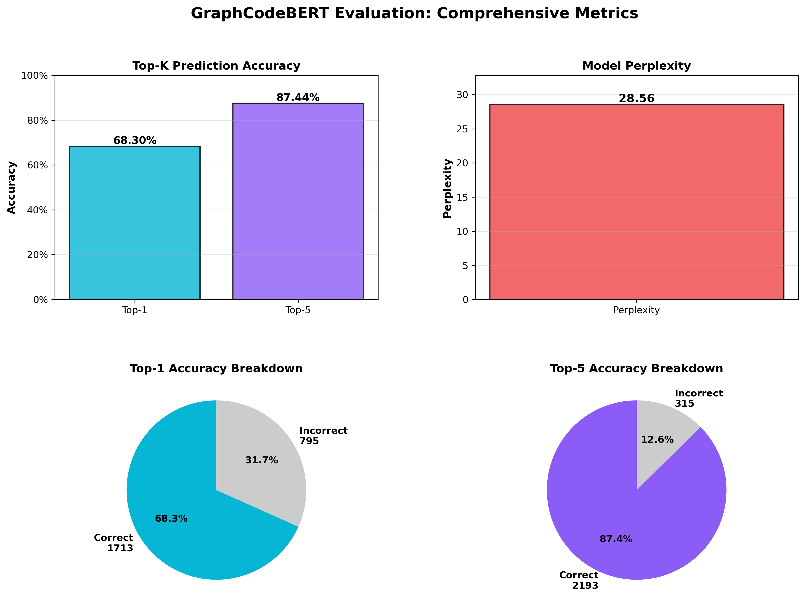
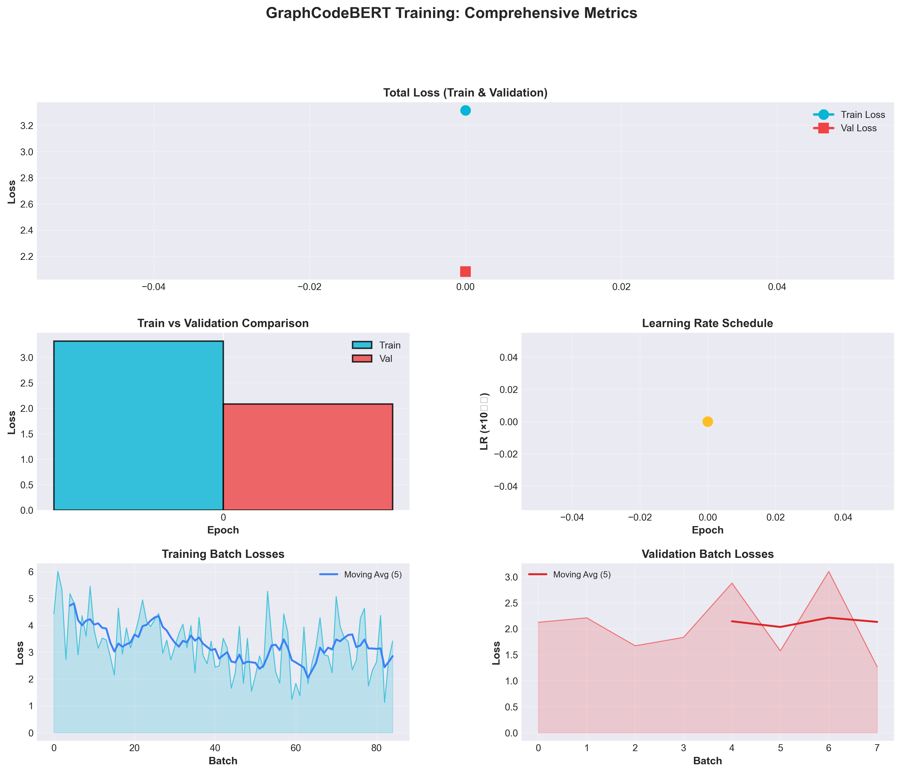

***STEP 1: Train base model on Erlang***
Batch size: 32
Loaded 40 functions from output/graphcodebert_data/train.jsonl
Loaded 5 functions from output/graphcodebert_data/valid.jsonl
Epochs: 3

Epoch 1/3
INFO -   Average losses - Total: 1.9575, MLM: 2.1919, Edge: 2.1693, Align: 1.5113
INFO -   Validation losses - Total: 1.9322, MLM: 2.0639, Edge: 2.6138, Align: 1.1190

Epoch 2/3
INFO -   Average losses - Total: 1.7960, MLM: 1.6933, Edge: 2.4182, Align: 1.2765
INFO -   Validation losses - Total: 1.5909, MLM: 1.1496, Edge: 2.5967, Align: 1.0264

Epoch 3/3
INFO -   Average losses - Total: 1.8460, MLM: 1.9644, Edge: 2.0218, Align: 1.5520
INFO -   Validation losses - Total: 1.7077, MLM: 1.5471, Edge: 2.4848, Align: 1.0911

***STEP 2 : Evaluate after base_model -> Erlang***
mlm_erlang:
  mlm_accuracy: 0.6797
  mlm_loss: 2.0032
  perplexity: 7.4130
  top5_accuracy: 0.8105
  top10_accuracy: 0.8431
  total_examples: 5.0000
  total_masked_tokens: 153.0000
{'mlm_erlang': {'mlm_accuracy': 0.6797385620915033, 'mlm_loss': 2.003233953239092, 'perplexity': 7.412990641571614, 'top5_accuracy': 0.8104575163398693, 'top10_accuracy': 0.8431372549019608, 'total_examples': 5, 'total_masked_tokens': 153}}

======================================================================
                Evaluation Results - C++ (Not trained yet)                      
======================================================================
Snippets evaluated:     100
Total masked tokens:    2500
----------------------------------------------------------------------
Top-1 Accuracy:         61.92% (1548/2500)
Top-5 Accuracy:         76.56% (1914/2500)
Perplexity:             223.0452
======================================================================

***STEP 3: Train model from Erlang on C++ ***
Loaded 500 samples
batch_size: 32
epochs: 3

Epoch 1 Results:
  Train - Total: 4.213040, MLM: 3.522328, Edge: 0.690712
  Val   - Total: 3.860605, MLM: 3.258986, Edge: 0.601619
  Learning Rate: 1.513514e-05
  Best Val Loss: inf (Epoch N/A)
  Patience:      0/3

Epoch 2 Results:
  Train - Total: 3.602106, MLM: 3.035109, Edge: 0.566997
  Val   - Total: 3.268689, MLM: 2.742136, Edge: 0.526554
  Learning Rate: 7.567568e-06
  Best Val Loss: 3.860605 (Epoch 1)
  Patience:      0/3

Epoch 3 Results:
  Train - Total: 3.241357, MLM: 2.729994, Edge: 0.511363
  Val   - Total: 2.959209, MLM: 2.455985, Edge: 0.503224
  Learning Rate: 0.000000e+00
  Best Val Loss: 3.268689 (Epoch 2)
  Patience:      0/3

  Evaluating 100 snippets...

***STEP 4 : Evaluate after base_model -> Erlang -> C++**
======================================================================
                    Evaluation Results - C++                      
======================================================================
Snippets evaluated:     100
Total masked tokens:    2500
----------------------------------------------------------------------
Top-1 Accuracy:         62.32% (1558/2500)
Top-5 Accuracy:         76.60% (1915/2500)
Perplexity:             233.0946
======================================================================

mlm_erlang:
  mlm_accuracy: 0.7755
  mlm_loss: 1.3108
  perplexity: 3.7090
  top5_accuracy: 0.8571
  top10_accuracy: 0.8776
  total_examples: 5.0000
  total_masked_tokens: 147.0000

